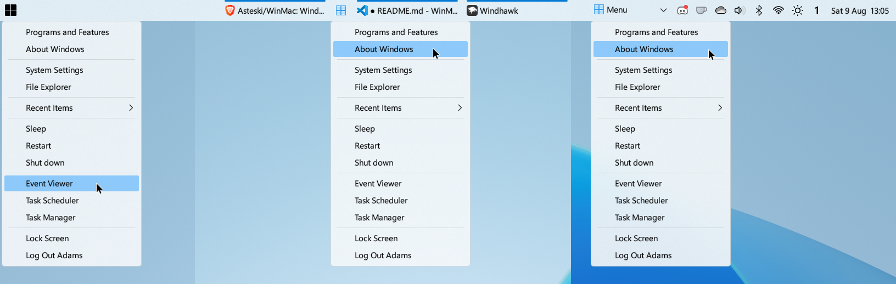

# WinMac Menu

A tiny, fast Win32 application that shows a Windows context-like popup menu. It’s configurable via an INI file, adapts to your light/dark theme, supports a dynamic Recent Items submenu, and can render in either native (legacy) or a modern owner‑draw style.



- Windows 10/11, x86 and ARM64 supported
- No installer, single EXE
- Low-latency popup that exits after the menu closes

## Features

- Recent Items: dynamic submenu from %AppData%\Microsoft\Windows\Recent
- Config-driven items with separators, folders as submenus, URIs, commands, power actions, and a consolidated Power menu (POWER_MENU)
- Light/Dark auto-adaptation; immersive dark hint on the invisible owner window
- Icons: per-item icon, optional DefaultIcon fallback, and optional system folder icon retrieval
- Placement controls (edges or cursor, with offsets), per‑monitor DPI aware
- First-letter activation, outside-click dismissal
- Folder submenu behaviors: lazy population, max depth, name-only items, optional “Open <folder>” entry
- Inline folder expansion (inject a folder’s contents directly into the root menu) with optional clickable header
- Granular extension hiding (global + recent-only override)

## Run

Double‑click the EXE to show the menu. It exits immediately after the menu closes.
Use `--config <path>` to point at a custom INI (single instance per INI path applies).

## Configuration

WinMacMenu reads an INI. If missing, a default is created.

Sections
- [General] global behavior and style
- [Placement] position rules
- [Menu] menu items Item1..ItemN
- [Icons] per-item icon mapping Icon1..IconN

Notes
- Environment variables expand in labels, paths, params, and icon paths (e.g., %USERNAME%).
- Indices N in [Icons] map to ItemN in [Menu].
- Comments: Lines beginning with `;` or `#` are ignored. Inline (end‑of‑line) comments are not supported—place comments on their own line.
- Duplicate keys: The last occurrence in a section wins (standard Win32 profile API behavior).
- Unknown keys are ignored.

### Quick Reference (All Keys)

| Section | Key | Values | Default | Notes / Synonyms / Deprecated |
|---------|-----|--------|---------|--------------------------------|
| General | RecentMax | integer (1..64) | 12 | Caps recent submenu items |
| General | FolderSubmenuDepth | 1..4 | 1 | Max recursive depth for folder submenus |
| General | FolderSubmenuOpen | single \| double | single | single = activate on first click; double = require second click |
| General | FolderShowOpenEntry | true/false | true | Adds "Open <folder>" entry at top when single-click open enabled |
| General | MenuStyle | legacy | legacy | modern hidden unless compiled with ENABLE_MODERN_STYLE |
| General | DefaultIcon | path | (empty) | .ico file; env vars expand |
| General | ShowIcons | true/false | false | LegacyIcons (deprecated) still accepted |
| General | ShowFolderIcons | true/false | false | Uses system small folder icon (unless per-item icon) |
| General | ShowExtensions | true/false | true | HideExtensions (deprecated inverse) overrides if present |
| General | RecentShowExtensions | true/false | true | RecentHideExtensions (deprecated inverse) overrides if present |
| General | RecentShowCleanItems | true/false | true | Adds clear command to recent submenu |
| General | ShowHidden | true/false | false | Hidden attribute files |
| General | ShowDotfiles | false\|true\|filesonly\|foldersonly | false | true=both; synonyms: files-only/folders-only |
| General | RecentLabel | fullpath\|name | fullpath | name synonyms: filename,file,leaf |
| General | LogConfig | off\|basic\|verbose \| 0/1/2/true/false | off | basic=true=1, verbose=2 |
| General | LogFolder | path | (exe dir) | Dynamic file naming (see logging) |
| General | MenuWidth | 226..255 | 0 | Modern style only (ignored otherwise) |
| General | Corners | rounded\|square | rounded | Modern style only (or Modern section) |
| Placement | PointerRelative | true/false | false | Toggle pointer anchoring |
| Placement | Horizontal | left\|center\|right | right | Along working area |
| Placement | HOffset | integer | 16 | Pixels; negative flips semantics |
| Placement | Vertical | top\|center\|bottom | bottom | Along working area |
| Placement | VOffset | integer | 48 | Pixels; negative flips semantics |
| Menu | ItemN | see Menu format | (none) | Up to 64 entries |
| Icons | IconN | path | (none) | Maps to ItemN if item lacks explicit icon |
| Debug | LogConfig | (same as General) | (fallback) | Used only if not set in General |
| Debug | LogFolder | path | (fallback) | Used only if not set in General |

### Comment Syntax

Use `;` or `#` at the start of a line:

```
; This is a comment
# Also a comment
[General]
ShowIcons=true
```

Inline comments are not reliably ignored; avoid `Key=Value ; like this` patterns—place comments above.

### [General]

Key | Description
----|------------
MenuStyle | `legacy` (modern hidden unless compiled with ENABLE_MODERN_STYLE)
DefaultIcon | Optional path to a .ico used when an item has no explicit icon and (for folders) system folder icon isn’t used
ShowIcons | `0|1` (renamed from LegacyIcons; LegacyIcons still accepted for backward compatibility)
ShowExtensions | `0|1` (default 1). When 0, file extensions are hidden in folder listings, inline expansions, and recent items (filename mode). Deprecated `HideExtensions` (legacy) still honored and inverts this value.
RecentShowExtensions | `0|1` (default 1). When 0, extensions are hidden in the Recent submenu (filename mode) regardless of ShowExtensions. Deprecated `RecentHideExtensions` still honored and inverts this value.
RecentShowCleanItems | `0|1` (default 1). When 1 adds a separator + "Clear Recent Items" entry at the bottom of the Recent submenu that deletes all .lnk entries from the system Recent folder.
ShowFolderIcons | `0|1` when true uses the system small folder icon for folder items/submenus instead of DefaultIcon unless a per-item icon is set
RecentMax | Maximum recent entries (default 12)
FolderSubmenuDepth | Max nested folder submenu depth (1–4)
FolderSubmenuOpen | `single|double` click depth-1 submenu folders to open (default single)
FolderShowOpenEntry | `true|false` show an “Open <folder>” top entry inside folder submenus when single-click open is active
ShowHidden | Show items with Hidden attribute
ShowDotfiles | `false|true|filesonly|foldersonly` extended dotfile visibility (dot overrides hidden filter for those names)
RecentLabel | `fullpath|name` controls label style for recent items (name aliases: filename, file, leaf)
PointerRelative | `0|1` position near cursor instead of configured edges
LogConfig | `off|0|false`, `basic|1|true`, `verbose|2` – logging level (can reside in [General] or [Debug])
LogFolder | Optional folder path (env vars expand) where a dynamic log file will be created. If omitted, the executable directory is used.

(Width / rounded corner settings for a modern style are intentionally omitted unless modern build is enabled.)

### Extension Visibility Details
### Logging Details
- Lookup order for `LogConfig` and `LogFolder`: `[General]` then `[Debug]` (first non-empty wins).
- Levels:
  - off / 0 / false: no output
  - basic / 1 / true: one config summary block to debugger (OutputDebugString) and to the log file if logging enabled
  - verbose / 2 : basic summary plus a per-item listing (Type, Label, Path, Icon, Params)
- Dynamic log file name pattern: `WinMacMenu_<configBase>_<yyMMdd-HHmm>.log` where `<configBase>` is the INI filename without extension. Timestamp uses local time when config loads (first run of process).
- Location: if `LogFolder` is set its expanded path is used (folder auto-created best-effort). Otherwise the executable directory.
- Encoding: UTF-8 (no BOM) with newline per entry.
- Legacy: `LogConfig=true` continues to map to basic. The former `LogFile` key is deprecated and replaced by `LogFolder` + dynamic naming (direct absolute filenames can be simulated by setting a dedicated empty folder path).
- Dot-prefixed files (like `.gitignore`) are not extension-stripped (mirrors Explorer convention).
- Keys now use positive logic: ShowExtensions / RecentShowExtensions (older HideExtensions / RecentHideExtensions still parsed and invert).
- Precedence for recent items when `RecentLabel=name`:
  1. RecentShowExtensions=0 (or legacy RecentHideExtensions=1) → hide extension
  2. Else ShowExtensions=0 (or legacy HideExtensions=1) → hide extension
  3. Else extension shown
- Folder listings & inline expansions ignore the recent-specific key and use only ShowExtensions (or legacy HideExtensions inversion).

### Icon Precedence
For each menu item / popup root:
1. Explicit per-item icon (fifth field or [Icons] mapping)
2. (Folders only, when ShowFolderIcons=1) System folder icon
3. DefaultIcon (if set)
4. None

Recent submenu root & Power menu root follow: per-item icon > DefaultIcon. The optional "Clear Recent Items" command (when `RecentShowCleanItems=1`) has no icon.

### [Placement]
Used when PointerRelative = 0.

- HPlacement = Left | Center | Right
- HOffset   = integer (pixels; negative allowed to invert side padding semantics)
- VPlacement = Top | Center | Bottom
- VOffset   = integer

### [Menu]

ItemN = Label | TYPE | PathOrTarget | Params | IconPath

TYPE values:
- URI, FILE, CMD
- FOLDER (clickable or mode-adjusted by params tokens)
- FOLDER_SUBMENU
- POWER_SLEEP, POWER_SHUTDOWN, POWER_RESTART, POWER_LOCK, POWER_LOGOFF
- POWER_MENU (adds aggregated power submenu: Sleep, Shut down, Restart, Lock, Log off)
- RECENT_SUBMENU
- SEPARATOR

Folder params tokens (space-separated, case-insensitive):
- `submenu` treat as submenu (like FOLDER_SUBMENU)
- `link` force clickable folder
- `inline` inject contents at root (files & lazy submenus for subfolders)
- `inlineopen` clickable header + inline contents
- `notitle` / `noheader` suppress header row (with inline/inlineopen)

Example:
```
Item10=Code|FOLDER|%USERPROFILE%\Code|inline|
Item11=Scripts|FOLDER|%USERPROFILE%\Scripts|inline notitle|
Item12=Projects|FOLDER|%USERPROFILE%\Projects|inlineopen|
```

### Inline Expansion Notes
- Subdirectories become lazy submenus (depth starts at 2)
- Visibility filters apply (ShowHidden / ShowDotfiles modes)
- No automatic separator insertion

### [Icons]
`IconN` maps to `ItemN` if the item itself doesn’t define an icon path.

### Experimental Flags Recap
- inline, inlineopen, notitle/noheader (removable without schema changes)

## Behavior Details
- First-letter activation
- Outside click dismisses menu
- DPI-aware scaling via system menu metrics
- Icons in legacy mode use MIIM_BITMAP, keeping native look (no custom owner-draw)
- Recent resolves .lnk targets; missing targets skipped
- Power actions: consistent markers used internally (POWER_MENU aggregates)
- Single-instance per INI path
- Second invocation toggle: launching the executable again (e.g., via a Windows key binding in an external tool) sends a toggle message. If the menu is open it closes; if closed it opens at the configured position. This enables assigning the EXE both to open and to dismiss via the same key.

## Troubleshooting

- Icons look blurry: use 16x16 .ico where possible. Large PNGs in .ico may scale poorly.
- Folder submenus are slow: contents load lazily on first open; deep folders or network paths can still be slow — reduce FolderMaxDepth.

## Notes

- Built with standard Win32 APIs: user32, shell32, shlwapi, comctl32, uxtheme, dwmapi, powrprof, advapi32.
- This app uses normal popup menus; exact visual parity with the system Win+X menu isn’t guaranteed.
- It's recommended to use it together with Open-Shell, so the WinMacMenu can be triggered by clicking the Start menu button with the left mouse button or by pressing the Windows key.
- You can also pin shortcuts to taskbar, or add to Links toolbar. Each shortcut can refer to different config.ini files.

> [!NOTE]
> **Please be informed that this is a beta version - you're using it at your own risk!**

## Future plans

- Update modern style to look like Windows 11 context menu
- Sub-menus sorting options
- Different depths level for specific folders
- Possibility to open WinMac menu with right clicking Start button using Open-Shell ([#2286](https://github.com/Open-Shell/Open-Shell-Menu/issues/2286))