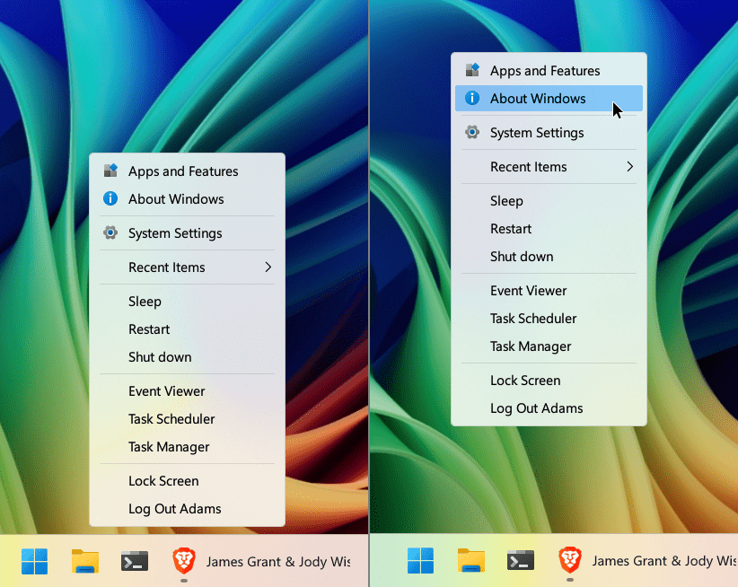
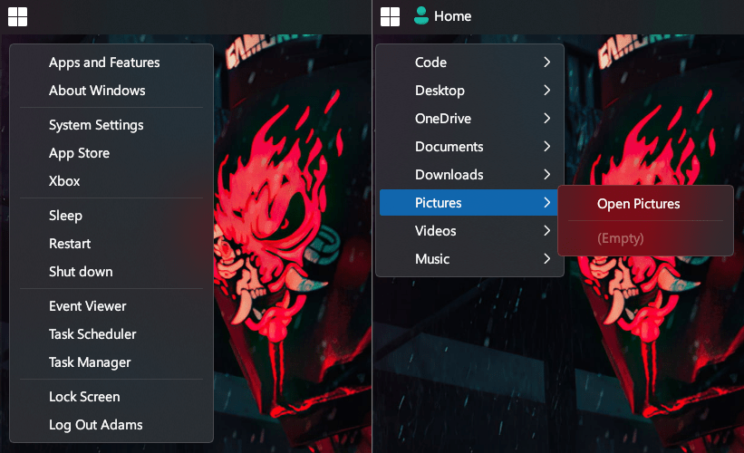

# WinMac Menu

Win32 application that shows a Windows context-like popup menu. It’s configurable via an INI file, adapts to your light/dark theme, allows to specify relative and absolute positioning, supports a dynamic Recent Items and Force Quit submenus, shell objects, folder submenus, power options menu, showing folder content in root menu, icons, sorting and many more!

- Windows 10/11, x86 and ARM64 supported
- No installer, single EXE
- Low-latency popup
- [Discover the range of application use cases](https://github.com/Asteski/WinMac-Menu/wiki/Examples-of-use)

### Windows 11:

### Windows 10:

## Features

- Config-driven items with separators, folders as submenus, URIs, commands, power actions, and more.
- Recent Items - dynamic submenu from %AppData%\Microsoft\Windows\Recent
- Force Quit - dynamic submenu to forcibly end tasks
- This PC - dynamic submenu to list This PC content
- Home - dynamic submenu to show User Profile folder
- Light/Dark auto-adaptation - immersive dark hint on the invisible owner window
- Icons - per-item icons, theme-aware overrides (light/dark), optional DefaultIcon + theme variants, and optional system folder icon retrieval
- Placement controls (edges, center, or cursor, with offsets + ignore options), per‑monitor DPI aware
- First-letter activation, outside-click dismissal
- Folder submenu behaviors: lazy population, max depth, name-only items, optional “Open <folder>” entry
- Inline folder expansion (inject a folder’s contents directly into the root menu) with optional clickable header
- Sorting of folder content by name, date, size and type
- Granular extension hiding (global + recent-only override)

## Run

**Quick Start**: Double‑click the EXE. By default, it runs in background mode with a system tray icon.

**Modes**:
- **Background Mode (default)** - App stays running in background. Launch again to toggle/show menu.
- **Single Run** - Set `RunInBackground=false` in config to exit after menu closes (legacy behavior).
  - To start silently in background, without showing the menu on first launch, set `ShowOnLaunch=false`.

**Custom config**: Use `--config <path>` to point at a custom INI (single instance per INI path applies).

## Sections
- [General] global behavior and style
- [Placement] position rules
- [Menu] menu items Item1..ItemN
- [Icons] per-item icon mapping Icon1..IconN and optional DefaultIcon/DefaultIconLight/DefaultIconDark
- [IconsLight] theme-specific per-item icons for light theme (Icon1..IconN)
- [IconsDark] theme-specific per-item icons for dark theme (Icon1..IconN)
- [Power] exclude specific power options
- [Sorting] sort folder content
- [RecentItems] item settings
- [TaskKill] item settings
- [ThisPC] item settings
- [Home] item settings
- [Logging]

You can find more details about each section in [Wiki](https://github.com/Asteski/WinMac-Menu/wiki) page.

## Behavior Details
- First-letter activation
- Outside click dismisses menu
- DPI-aware scaling via system menu metrics
- Icons in legacy mode use MIIM_BITMAP, keeping native look (no custom owner-draw)
- Recent resolves .lnk targets; missing targets skipped
- Power actions: consistent markers used internally (POWER_MENU aggregates)
- Single-instance per INI path
- Second invocation toggle: launching the executable again (e.g., via a Windows key binding in an external tool) sends a toggle message. If the menu is open it closes; if closed it opens at the configured position. This enables assigning the EXE both to open and to dismiss via the same key.

## Security & Privacy
- No telemetry. The app makes no network connections and collects no data.
- Registry usage: optional HKCU\Software\Microsoft\Windows\CurrentVersion\Run entry when you enable “Start on login” from the tray. It’s off by default and only changed when you toggle it. There is no service or scheduled task.
- Keyboard/mouse hooks: installed only while the popup menu is visible to allow outside‑click/escape dismissal; they are immediately removed when the menu closes.
- Recent cleanup: choosing “Clear Recent Items list” deletes shortcut (.lnk) files from your user Recent folder. It doesn’t touch actual documents or programs. There’s no confirmation.
- Filesystem: reads your config.ini and enumerates folders you explicitly reference in the menu.

## Troubleshooting
- Empty folder submenu: check path, permissions, filters (ShowHidden / ShowDotfiles)
- No icons: ensure ShowIcons=true (or LegacyIcons=true for backward compatibility) and paths are correct
- Folder icons not appearing: set ShowFolderIcons=true; the system folder icon only shows when no per-item icon exists

## Notes
> [!NOTE]
**Please be informed that this is a beta version - you're using it at your own risk!**
- WinMacMenu reads an INI. If missing, a default (config.ini) is created.
- Environment variables expand in labels, paths, params, and icon paths (e.g., %USERNAME%).
- Settings GUI window is still in experimental phase, so I can't promise its stability for now.
- Indices N in [Icons]/[IconsLight]/[IconsDark] map to ItemN in [Menu].
- Generated default INI contains no comments (to keep the file minimal). Comments are still supported by the parser if you add them manually: lines beginning with `;` or `#` are ignored.
- Duplicate keys: The last occurrence in a section wins (standard Win32 profile API behavior).
- Unknown keys are ignored.
- Built with standard Win32 APIs: user32, shell32, shlwapi, comctl32, uxtheme, dwmapi, powrprof, advapi32.
- This app uses legacy popup menus; so no parity with Windows 11 Fluent Design System for now
- It's recommended to use it together with Open-Shell, so the WinMacMenu can be triggered by clicking the Start menu button with the left mouse button or by pressing the Windows key.
- You can also pin shortcuts to taskbar, or add to custom toolbar. Each shortcut can refer to different config.ini files with different file names for ini file.
- INI file used in current session will be highlighted in tooptip of tray icon, if file name is different than default (config.ini).
- You can reference either *.dll or *.exe file in [Icons] section as path or jsut a file name (if the file resides in directory defined in %PATH%).

## Future plans
- custom activation shortcuts
- rewrite settings page in WinUI3
- open folder of specific file entry in Recent Items list with middle mouse button
